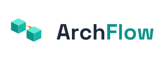
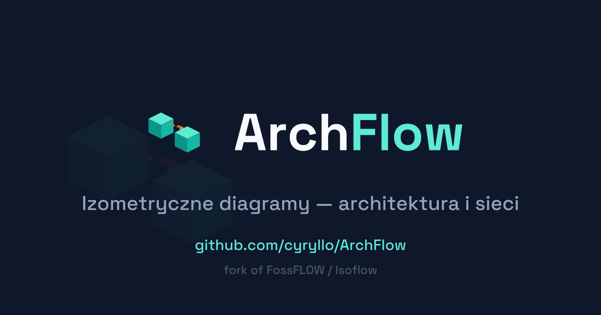

<p align="center">
  <picture>
    <source media="(prefers-color-scheme: dark)" srcset="docs/brand/logo-dark.svg">
    
  </picture>
</p>

<p align="center">
 <a href="README.md">English</a> | <a href="docs/README.pl.md">Polski</a>
</p>

<p align="center">
  
</p>

**ArchFlow** is a fork of <a href="https://github.com/stan-smith/FossFLOW">FossFLOW</a> by Stan Smith, which is itself a fork/rewrite of <a href="https://github.com/markmanx/isoflow">Isoflow</a> by @markmanx — this project stands on both of their shoulders. If either project has helped you, please check them out and consider supporting their work.

------------------------------------------------------------------------------------------------------------------------------
ArchFlow is a powerful, open-source web app for creating beautiful isometric diagrams. Built with React and the <a href="https://github.com/markmanx/isoflow">Isoflow</a> (forked and published to NPM as `fossflow`) library, it runs entirely in your browser. A native desktop version (Electron) is also available in `packages/fossflow-desktop`.

- **📝 [ARCHFLOW_TODO.md](https://github.com/cyryllo/ArchFlow/blob/master/ARCHFLOW_TODO.md)** - Current issues and roadmap with codebase mappings, most gripes are with the isoflow library itself.
- **🤝 [CONTRIBUTING.md](https://github.com/cyryllo/ArchFlow/blob/master/CONTRIBUTING.md)** - How to contribute to the project.

### Performance updates
 - **Reduced frame refresh delay, should look much smoother now**

### Multilingual Support
- **2 Languages Supported** - Full interface translation in English and Polish
- **Language Selector** - Easy-to-use language switcher in the app header
- **Complete Translation** - All menus, dialogs, settings, tooltips, and help content translated
- **Locale-Aware** - Automatically detects and remembers your language preference

### Improved Connector Tool
- **Click-based Creation** - New default mode: click first node, then second node to connect
- **Drag Mode Option** - Original drag-and-drop still available via settings
- **Mode Selection** - Switch between click and drag modes in Settings → Connectors tab
- **Better Reliability** - Click mode provides more predictable connection creation


## 🐳 Quick Deploy with Docker

```bash
# Using Docker Compose (recommended - includes persistent storage)
docker compose up

# Or build and run the image locally
docker build -t archflow:local .
docker run -p 80:80 -v $(pwd)/diagrams:/data/diagrams archflow:local
```

Server storage is enabled by default in Docker. Your diagrams are saved as JSON files to `./diagrams` on the host (mounted to `/data/diagrams` inside the container). When this is active, the app detects it automatically and switches to the persistent "App Storage" diagram list — the session-only Save/Load/Quick-save buttons disappear, since there's no need for them anymore.

To disable server storage and fall back to browser-only (session) storage, set `ENABLE_SERVER_STORAGE=false`:
```bash
docker run -p 80:80 -e ENABLE_SERVER_STORAGE=false archflow:local
```

## 🖥️ Desktop App (Electron)

A native desktop version is also available for Windows, macOS, and Linux — it wraps the same web app in a native window, with native "Save As"/"Open" dialogs instead of browser downloads.

```bash
# Run in dev mode (opens a native window)
npm run dev:desktop

# Build installers (Windows .exe, macOS .dmg, Linux AppImage/.deb)
npm run build:desktop
```

Installers are written to `packages/fossflow-desktop/dist/`. Both commands build the library and web app internally first, so there's no separate build step needed.

Diagrams are saved as real files on disk, automatically — no location prompt, no browser storage involved. The desktop app creates an `ArchFlow` folder inside your OS's Documents directory (`~/Documents/ArchFlow`, or the localized equivalent, e.g. `~/Dokumenty/ArchFlow` on a Polish system) the first time it runs, and every diagram you save through the "📁 App Storage" list becomes a `.json` file there. As with Docker, the session-only Save/Load/Quick-save buttons are hidden in the desktop app, since real persistent storage is always available.

## Quick Start (Local Development)

```bash
# Clone the repository
git clone https://github.com/cyryllo/ArchFlow
cd ArchFlow

# Install dependencies
npm install

# Build the library (required first time)
npm run build:lib

# Start development server
npm run dev
```

Open [http://localhost:3000](http://localhost:3000) in your browser.

## Monorepo Structure

This is a monorepo containing several packages:

- `packages/fossflow-lib` - React component library for drawing network diagrams (built with Webpack)
- `packages/fossflow-app` - Progressive Web App which wraps the lib and presents it (built with RSBuild)
- `packages/fossflow-backend` - Optional backend server for persistent diagram storage
- `packages/fossflow-desktop` - Native desktop app (Electron)

### Development Commands

```bash
# Development
npm run dev          # Start app development server
npm run dev:lib      # Watch mode for library development

# Building
npm run build        # Build both library and app
npm run build:lib    # Build library only
npm run build:app    # Build app only

# Desktop app (Electron)
npm run dev:desktop   # Run desktop app in dev mode
npm run build:desktop # Build desktop installers

# Testing & Linting
npm test             # Run unit tests
npm run lint         # Check for linting errors

# E2E Tests (Selenium)
cd e2e-tests
./run-tests.sh       # Run end-to-end tests (requires Docker & Python)

# Publishing
npm run publish:lib  # Publish library to npm
```

## How to Use

### Creating Diagrams

1. **Add Items**:
   - Press the "+" button on the top right menu, the library of components will appear on the left
   - Drag and drop components from the library onto the canvas
   - Or right-click on the grid and select "Add node"

2. **Connect Items**: 
   - Select the Connector tool (press 'C' or click connector icon)
   - **Click mode** (default): Click first node, then click second node
   - **Drag mode** (optional): Click and drag from first to second node
   - Switch modes in Settings → Connectors tab

3. **Save Your Work**:
   - **🌐/📁 App Storage** (Docker with server storage enabled, or the desktop app) - persistent, named diagrams you can list, load, and delete; saved as real files (`./diagrams` on the Docker host, `~/Documents/ArchFlow` on desktop)
   - **Save / Load / Quick Save (Session)** - only shown when no persistent storage is available (plain web hosting, or Docker with server storage disabled); saves to the browser's storage only
   - **Export** - Download the current diagram as a JSON file, always available regardless of platform
   - **Import** - Load a diagram from a JSON file, always available

### Storage Options

Which options you see depends on where ArchFlow is running:

| Where | What you get |
|---|---|
| Desktop app | **📁 App Storage** (files in `~/Documents/ArchFlow`) + Export/Import. No session buttons. |
| Docker, server storage enabled (default) | **🌐 App Storage** (files in `./diagrams` on the host) + Export/Import. No session buttons. |
| Plain web hosting / Docker with server storage disabled | Session Save/Load/Quick Save (browser storage only, cleared if you clear browser data) + Export/Import |

- **Auto-Save**: The last-opened diagram is automatically restored on reload/relaunch (browser `localStorage` / desktop app profile), independent of which storage option above you're using.

## Contributing

We welcome contributions! Please see [CONTRIBUTING.md](CONTRIBUTING.md) for guidelines.

## Documentation

- [ARCHFLOW_ENCYCLOPEDIA.md](ARCHFLOW_ENCYCLOPEDIA.md) - Comprehensive guide to the codebase
- [ARCHFLOW_TODO.md](ARCHFLOW_TODO.md) - Current issues and roadmap
- [CONTRIBUTING.md](CONTRIBUTING.md) - Contributing guidelines

## License

MIT
